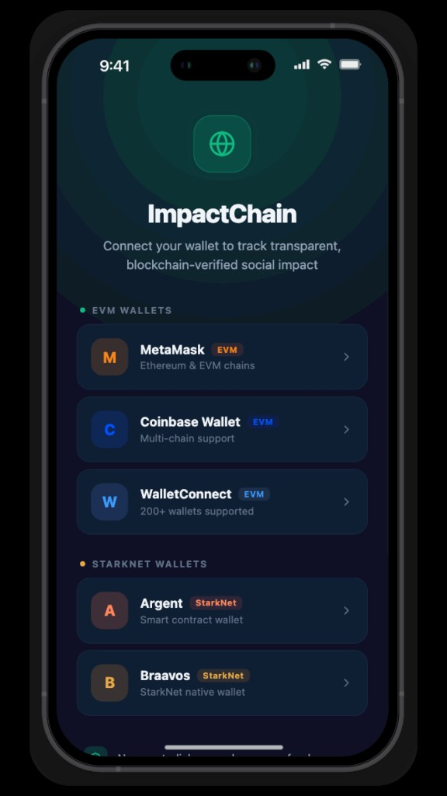
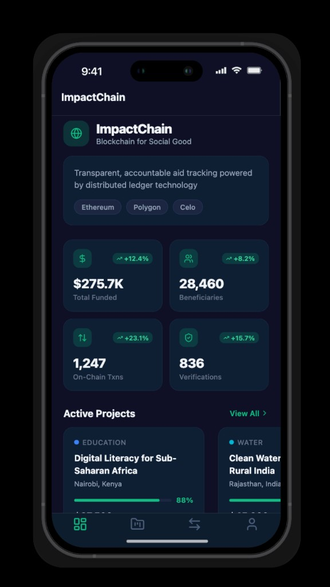
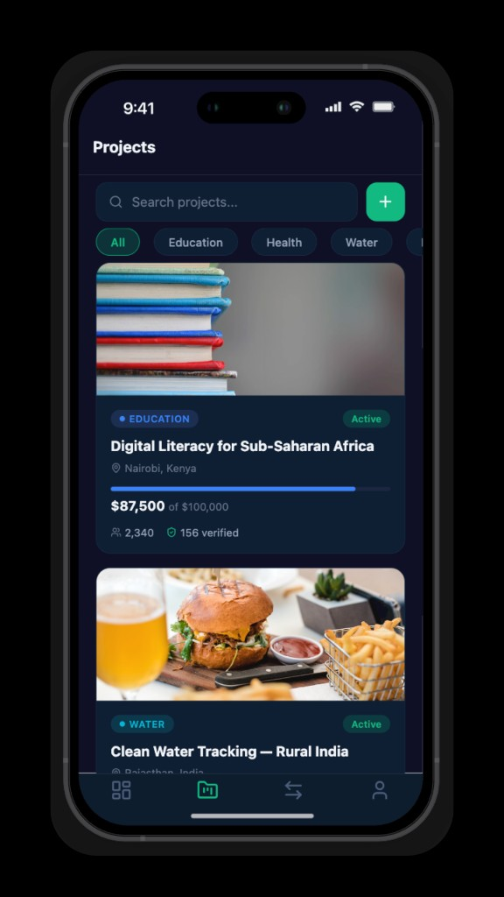
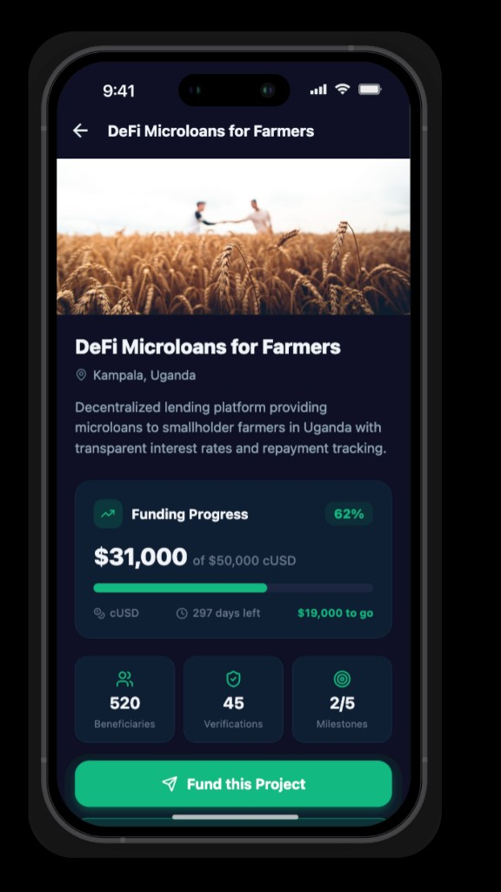
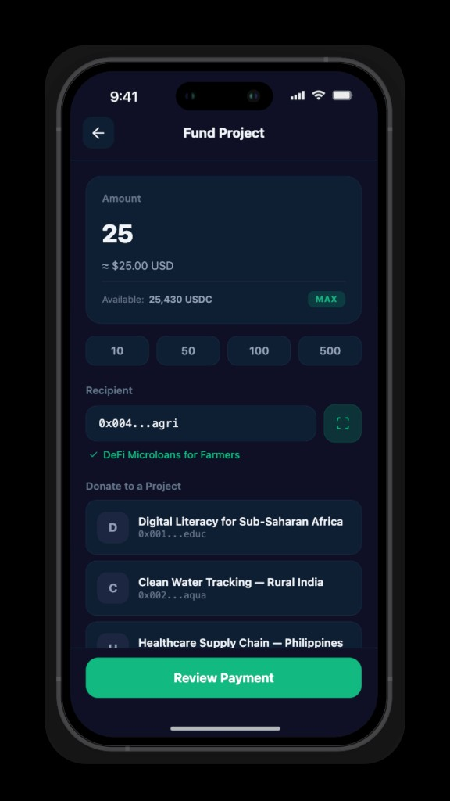

# ImpactChain

**Blockchain for Social Good** — A mobile-first platform that brings transparency, accountability, and trust to humanitarian aid and social impact funding through blockchain technology.

<p align="center">
  
  
  
  
  
</p>

---

## The Problem

Billions of dollars flow into humanitarian aid every year, yet:

- **Donors** cannot verify that funds reach intended beneficiaries
- **Organizations** struggle to demonstrate measurable, verifiable impact
- **Beneficiaries** have no visibility into the process
- **Centralized databases** can be altered, making records unreliable

This erodes trust, reduces donor engagement, and diminishes the effectiveness of humanitarian efforts.

## The Solution

ImpactChain leverages distributed ledger technology to create an end-to-end transparent aid tracking system where every dollar is traceable and every outcome is verifiable.

- **On-chain transaction recording** — Every donation, disbursement, and milestone is permanently recorded on the blockchain, creating an immutable audit trail
- **Milestone-based disbursements** — Smart contracts release funds only when measurable impact is verified
- **Multi-chain support** — Operates across Ethereum, Polygon, Celo, and StarkNet
- **Verifiable credentials** — Beneficiary outcomes are recorded as on-chain verifiable credentials
- **Crypto payments** — Send and receive funds in ETH, USDC, BTC, and more

---

## Demo Videos

<p align="center">
  <a href="https://youtu.be/tM80a0o6Wvg?si=cLmZw3kiB8MoGJmm">
    
  </a>
  &nbsp;
  <a href="https://youtu.be/SQ6wjr2zbS4?si=f6UiAu4U3xS1I7wr">
    
  </a>
</p>

---

## Screenshots

### Wallet Connection
Connect via MetaMask, Coinbase Wallet, WalletConnect (EVM), or Argent and Braavos (StarkNet).

<p align="center">
  
</p>

### Impact Dashboard
Real-time metrics: total funded amount, beneficiaries reached, on-chain transactions, and verification count.

<p align="center">
  
</p>

### Project Explorer
Browse and filter active social impact projects across education, health, water, agriculture, and governance.

<p align="center">
  
</p>

### Project Detail
Transparent funding progress, beneficiary count, verifications, milestones, and a direct link to the block explorer.

<p align="center">
  
</p>

### Fund a Project
Donate directly in crypto with quick-select amounts, project selection, and full payment review before submitting.

<p align="center">
  
</p>

---

## Key Features

| Feature | Description |
|---------|-------------|
| **Impact Dashboard** | Real-time on-chain metrics and project overview |
| **Project Explorer** | Search and filter projects by category with transparent progress tracking |
| **Transaction Feed** | Live blockchain activity with expandable on-chain details |
| **Wallet Integration** | MetaMask, Argent, Coinbase, WalletConnect across 4 networks |
| **Send & Receive** | Direct crypto payments for project funding and disbursements |
| **Create Projects** | Publish social impact projects with milestone-based funding and SDG tagging |
| **Fund Management** | Track earnings, allocate funds, and withdraw with full transparency |
| **Block Explorer** | Direct links to on-chain verification for every transaction |

---

## Supported Networks

| Network | Type |
|---------|------|
| **Ethereum** | Public, Layer 1 |
| **Polygon** | Public, Layer 2 |
| **Celo** | Public, Layer 1 (mobile-first) |
| **StarkNet** | Public, Layer 2 (ZK-rollup) |

---

## Tech Stack

- **React Native** (Expo) — Cross-platform mobile app (iOS, Android, Web)
- **Expo Router** — File-based routing with tab and modal navigation
- **TypeScript** — Type-safe development
- **Multi-chain smart contracts** — Ethereum, Polygon, Celo, StarkNet
- **Wallet SDKs** — MetaMask, Argent, WalletConnect integration
- **Lucide React Native** — Icon system

---

## Getting Started

### Prerequisites

- [Node.js](https://nodejs.org/) (v18+)
- [Bun](https://bun.sh/) (recommended) or npm

### Installation

```bash
# Clone the repository
git clone https://github.com/your-org/impactChain.git
cd impactChain/expo

# Install dependencies
bun install

# Start the development server
bun run start

# Web preview
bun run start-web
```

### Running on Device

1. Download [Expo Go](https://expo.dev/go) on your phone
2. Run `bun run start`
3. Scan the QR code from the terminal

### Simulators

```bash
# iOS Simulator
bun run start -- --ios

# Android Emulator
bun run start -- --android
```

---

## Project Structure

```
expo/
├── app/                        # Screens (Expo Router)
│   ├── (tabs)/                 # Tab navigation
│   │   ├── index.tsx           # Dashboard
│   │   ├── projects.tsx        # Project Explorer
│   │   ├── transactions.tsx    # Activity Feed
│   │   └── profile.tsx         # Profile & Wallet
│   ├── login.tsx               # Wallet connection
│   ├── project/[id].tsx        # Project detail
│   ├── send.tsx                # Send payments
│   ├── receive.tsx             # Receive funds
│   ├── create-project.tsx      # Create a project
│   ├── manage-funds.tsx        # Fund management
│   └── modal.tsx               # Verification modal
├── mocks/                      # Mock data
│   ├── metrics.ts
│   ├── projects.ts
│   └── transactions.ts
├── constants/                  # Theme and config
├── hooks/                      # Custom hooks
├── assets/                     # Images and icons
├── docs/screenshots/           # App screenshots
└── app.json                    # Expo config
```

---

## SDG Alignment

ImpactChain supports multiple Sustainable Development Goals:

- **SDG 1** — No Poverty (DeFi microloans)
- **SDG 3** — Good Health (healthcare supply chain tracking)
- **SDG 4** — Quality Education (digital literacy verification)
- **SDG 6** — Clean Water (water quality monitoring)
- **SDG 16** — Peace, Justice & Strong Institutions (community governance)
- **SDG 17** — Partnerships for the Goals

---

## Deployment

### Build for Production

```bash
# Install EAS CLI
bun i -g @expo/eas-cli

# Build for iOS
eas build --platform ios

# Build for Android
eas build --platform android

# Submit to stores
eas submit --platform ios
eas submit --platform android
```

---

## License

This project is licensed under the [MIT License](../LICENSE).

---

*ImpactChain: Making every dollar traceable, every impact verifiable.*
